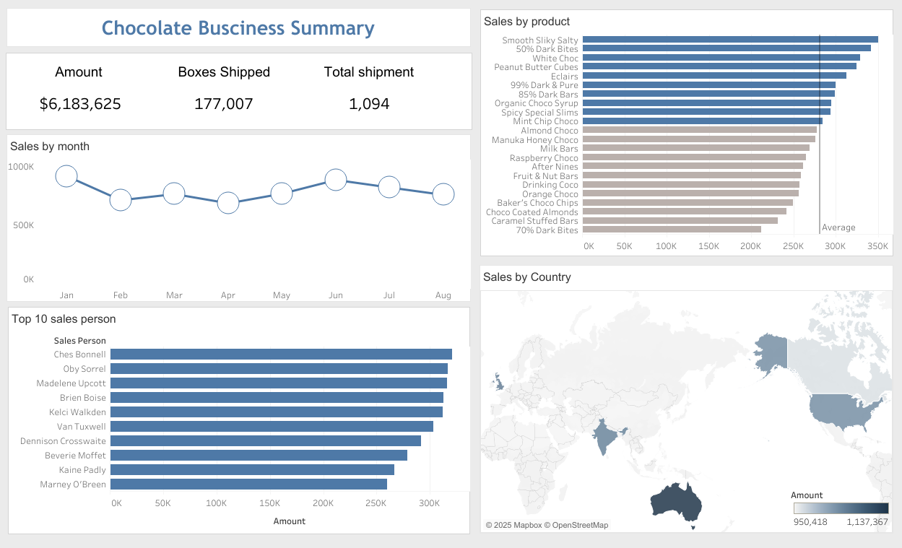

# Chocolate Business Summary - Tableau Project

This repository contains my first Tableau project, titled Business Summary.
The project is designed to provide a concise and insightful overview of key business metrics, including sales data, shipment statistics, top performers, and sales locations. 

# 1️⃣ KPIs

Displays key performance indicators:
✅ Total Sales ($) – Overall revenue from chocolate sales.
✅ Total Boxes Shipped – Number of boxes sent to customers.
✅ Total Shipment Count – Number of shipments processed.
Helps monitor overall business performance at a glance.

# 2️⃣ Line Chart – Monthly Sales Trend

Shows sales performance over time.
Helps identify seasonal trends, peak months, and sales fluctuations.
Useful for forecasting and planning future inventory & marketing strategies.

# 3️⃣ Bar Charts

🔹 Sales by Product (with Avg. Sales & Product Margin)
Compares sales across different chocolate products.
Includes average sales & product margin to evaluate profitability.
Helps identify best-selling and low-performing products.

🔹 Top 10 Sales Performers
Ranks the top 10 salespeople based on revenue.
Helps track employee performance and recognize top contributors.

# 4️⃣ Map – Sales by Country

Displays geographical distribution of chocolate sales.
Identifies top-performing regions and potential market expansion opportunities.
Useful for regional marketing and logistics planning.

Feel free to adjust or expand on any section depending on additional details you'd like to include.

# Tableau Project | Data Analysis | Visualization 

