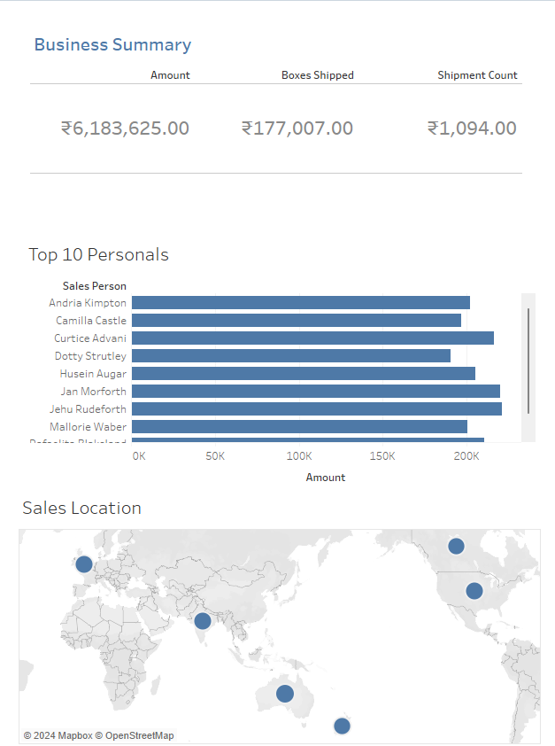

# Business Summary - Tableau Project

This repository contains my first Tableau project, titled Business Summary.
The project is designed to provide a concise and insightful overview of key business metrics, including sales data, shipment statistics, top performers, and sales locations. 

The workbook includes three sheets, each with a distinct focus:

# Sheet 1:
Sales & Shipment Overview

This sheet features a tile displaying three critical business metrics:

# Amount of Sales:
Total sales revenue generated within the selected period.
Boxes Shipped: The total number of boxes shipped to customers.
Shipment Count: The total number of individual shipments processed.

# Sheet 2: Top 10 Personals (Bar Chart)

This sheet provides a bar chart showcasing the top 10 performers (e.g., sales representatives or employees) based on their contribution to sales.
The chart allows for quick identification of the highest-performing individuals and their relative performance against one another.

# Sheet 3: Sales Locations (Map)

The final sheet visualizes sales data across different geographical locations using a map. 
This helps in understanding the distribution of sales activity and identifying high-performing regions or areas where additional focus might be needed.

Feel free to adjust or expand on any section depending on additional details you'd like to include.

# Tableau Project | Data Analysis | Visualization 

